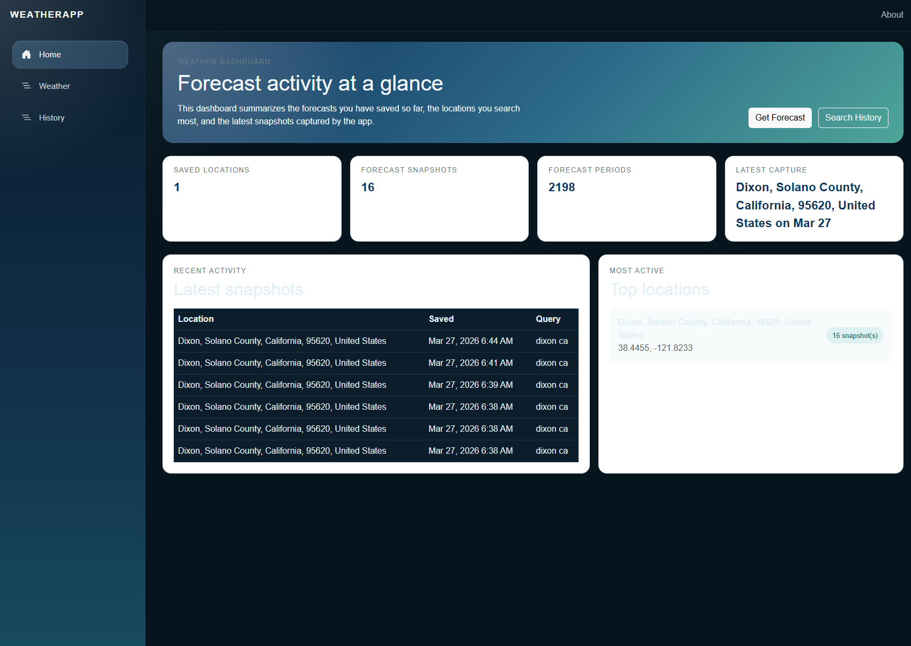

# Weather Dashboard App

A Blazor weather application that lets users search forecasts, view hourly and daily outlooks, and browse saved forecast history in a dashboard-style interface.

## Overview

This project combines live forecast lookup with local data storage so the app can show both current forecast data and previously saved forecast snapshots.

Users can:

- Search by city, ZIP code, or other location input
- View the next 12 hours of forecast data
- View the next 5 days of forecast data
- See weather condition icons alongside forecast conditions
- Review saved forecast history from SQLite
- View a dashboard summary of saved locations and activity
- Automatically switch between light and dark mode based on browser or system theme

## Features

- Hourly forecast display
- Daily forecast display
- Dashboard landing page
- Historical forecast search
- SQLite persistence with Entity Framework Core
- Tomorrow.io API integration
- Weather condition icon support
- Responsive layout
- Auto theme switching within browser `prefers-color-scheme`

## Tech Stack

- ASP.NET Core
- Blazor Server / Razor Components
- Entity Framework Core
- SQLite
- Tomorrow.io Weather API
- Bootstrap

## Project Structure

```text
WeatherApp/
├── Components/
│   ├── Layout/
│   └── Pages/
├── Data/
├── Models/
├── Services/
├── wwwroot/
├── Program.cs
├── appsettings.json
└── WeatherApp.csproj
```

## Pages

- `Home`  
  Dashboard view with saved forecast activity, latest capture, recent snapshots, and top locations.

- `Weather`  
  Forecast search page with hourly and daily forecast tables.

- `History`  
  Historical search page that reads previously saved forecast snapshots from the local database.

## Screenshots

You can add screenshots to a `docs/` folder and reference them here.

```md



```

## Getting Started

### Prerequisites

- .NET SDK
- Tomorrow.io API key

### Configuration

Set your Tomorrow.io API key in `appsettings.json` or use user secrets.

Example:

```json
"TomorrowIo": {
  "BaseUrl": "https://api.tomorrow.io",
  "Units": "imperial",
  "ApiKey": "YOUR_API_KEY"
}
```

The SQLite database connection is configured in `appsettings.json`:

```json
"ConnectionStrings": {
  "WeatherDatabase": "Data Source=weather.db"
}
```

### Run the App

```bash
dotnet restore
dotnet run
```

Then open the local URL shown in the terminal.

## How It Works

1. The app sends a forecast request to the Tomorrow.io API.
2. Forecast data is normalized into app models.
3. Forecast snapshots are saved to a local SQLite database.
4. The dashboard summarizes the stored data.
5. The history page searches saved forecast snapshots by date range, location, and period type.

## Data Storage

The app stores:

- Saved locations
- Forecast snapshots
- Forecast periods for hourly, daily, and minutely forecasts

This allows the history page and dashboard to work from previously fetched forecast data.

## Theme Support

The app supports:

- Light mode
- Dark mode
- Automatic theme switching based on browser or operating system preference

## Attribution

Weather icons are provided by Tomorrow.io.

If you use the included icons, keep the Tomorrow.io attribution in the app.

## Future Improvements

- Charts for forecast trends
- Favorite locations
- Better grouping for historical snapshots
- Export or reporting features

